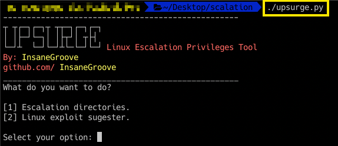

# Upsurge

This software has been programmed with the purpose of Linux escalation privileges as also Linux exploitation. The linux exploit sugester comes from [**mzet- and bcoles**](https://github.com/mzet-/linux-exploit-suggester). 


# Purpose

Understand Linux directories and the importance from the sysadmin to give some privileges in different directories as also a huge interest of Linux exploitation. 

# Usage

Run this script with this quick download:


wget https://raw.githubusercontent.com/InsaneGroove/upsurge/master/upsurge.py


Please, once you have installed give it the permissions with ```chmod +x upsurge.py ```.



# Requirments

To use Upsurge, the OS must be a Linux Distribution, as also get to install different libraries such as **os and sys**.

# Updates

According the time Ambush it’s going to improve its functions adding more features at it. Every feedback is very welcome.
If you have any questions or feedbacks, feel free to contact me in twitter as [**@InsanePgroove**](https://twitter.com/insanePgroove)

# Look me in Platzi

[**@sampar01**](https://platzi.com/@sampar01)
